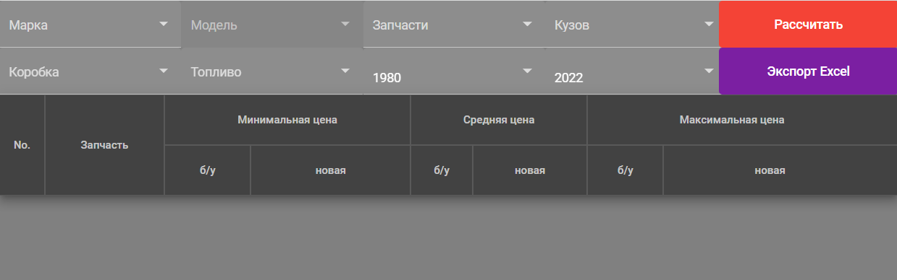
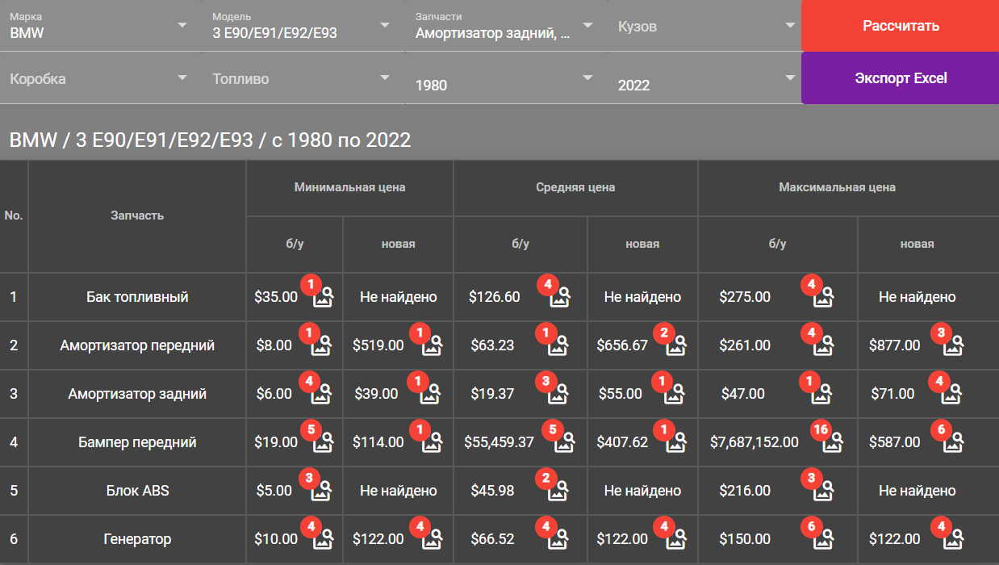
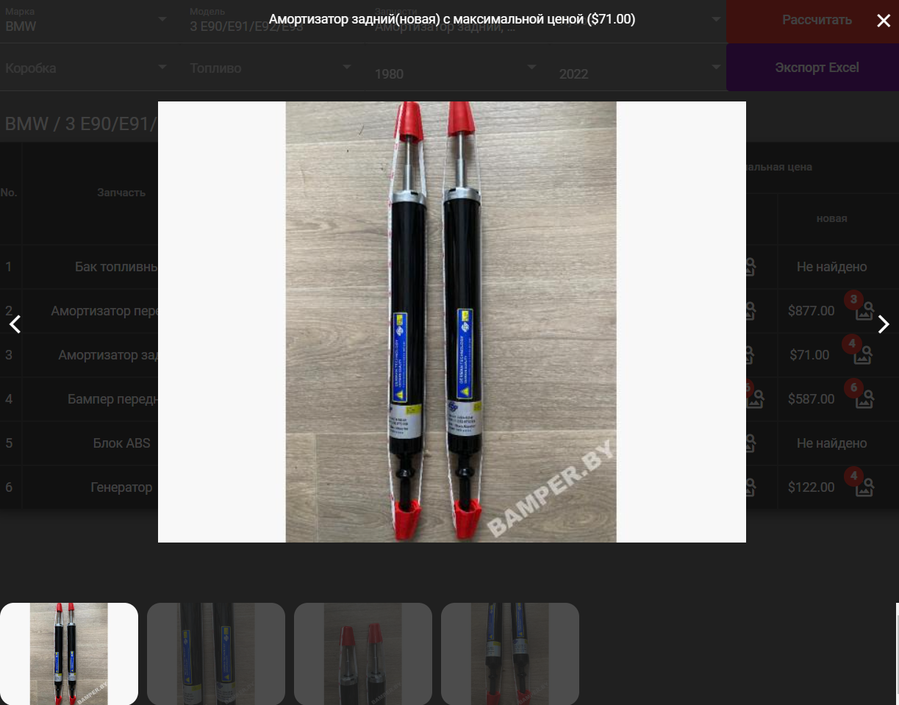
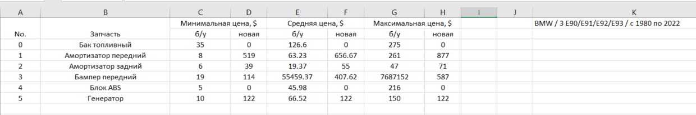
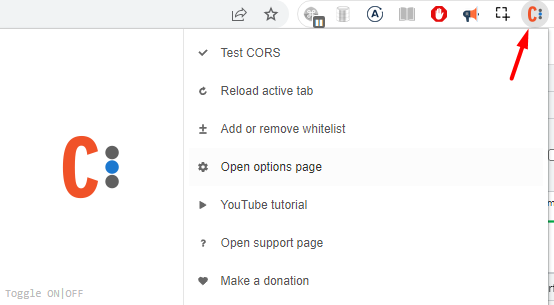

# AutoPareParts

This project was generated with [Angular CLI](https://github.com/angular/angular-cli) version 13.1.2.
Project uses Angular Material components for display view.

Application based on famous site with auto pare parts [bamper.by](https://bamper.by/).
App calculates min, max and average prices for selected second hand and new pare parts(if current part exists).
User can choose additional param for filtration.
After prices calculation user can see prices and pare part images for current position.
And it's possible to download calculated table to excel file.

Default view

Result table

Image viewer

Downloaded excel file

Note
For correct work please use Allow CORS extension

## Development server

Run `ng serve` for a dev server. Navigate to `http://localhost:4200/`. The app will automatically reload if you change any of the source files.

## Code scaffolding

Run `ng generate component component-name` to generate a new component. You can also use `ng generate directive|pipe|service|class|guard|interface|enum|module`.

## Build

Run `ng build` to build the project. The build artifacts will be stored in the `dist/` directory.

## Running unit tests

Run `ng test` to execute the unit tests via [Karma](https://karma-runner.github.io).

## Running end-to-end tests

Run `ng e2e` to execute the end-to-end tests via a platform of your choice. To use this command, you need to first add a package that implements end-to-end testing capabilities.

## Further help

To get more help on the Angular CLI use `ng help` or go check out the [Angular CLI Overview and Command Reference](https://angular.io/cli) page.
